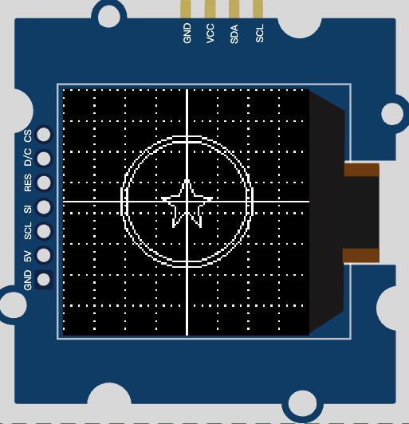

# Task 3: ESP32 MicroPython Grove SH1107 OLED 龍珠定位測試

## 目標
本題使用 Wokwi 的 Grove OLED 顯示器元件，型號為 `board-grove-oled-sh1107`。這塊不是前一題的 SSD1306 `128x64` OLED，而是 SH1107 單色 OLED，解析度為 `128x128`。

目前 `main.py` 的目標很單純：
- 使用 ESP32 透過 I2C 控制 SH1107 OLED。
- 在 OLED 上畫出一顆龍珠圖案。
- 加上 grid 定位線，觀察圖案在實際可視區的位置。
- 記錄 SH1107 顯示座標與 Wokwi 元件外觀之間的位移問題。



## 硬體與顯示規格
Wokwi 元件：

```json
{
  "type": "board-grove-oled-sh1107",
  "id": "oled1",
  "rotate": 270
}
```

重要規格：
- 顯示晶片：`SH1107`
- 顯示類型：Monochrome OLED
- 解析度：`128 x 128`
- 顏色：單色，pixel 值 `1` 代表亮、`0` 代表暗
- 通訊介面：I2C
- 常用 I2C 位址：`0x3C`
- MicroPython driver：`lib/sh1107.py`

注意：這塊顯示器不能用 `ssd1306.py` 驅動。若用 SSD1306 的 `128x64` 假設，畫面會出現上下切半、內容 wrap、位置看起來不正常等問題。

## I2C 接線
`diagram.json` 目前接線如下：

```text
ESP32 3V3     -> OLED VCC
ESP32 GND.2   -> OLED GND.1
ESP32 GPIO22  -> OLED SDA
ESP32 GPIO21  -> OLED SCL.1
```

所以 `main.py` 必須使用：

```python
i2c = I2C(0, scl=Pin(21), sda=Pin(22))
```

若誤寫成：

```python
i2c = I2C(0, scl=Pin(22), sda=Pin(21))
```

SCL/SDA 會對調，常見結果是 I2C 裝置無回應，可能出現：

```text
OSError: [Errno 19] ENODEV
```

可以用以下方式檢查 I2C 是否有掃到裝置：

```python
print(i2c.scan())
```

若通訊正常，通常會看到 `60`，也就是十六進位的 `0x3C`。

## 目前 OLED 初始化
目前 `main.py` 使用 SH1107 driver，解析度設定為 `128x128`：

```python
oled_width = 128
oled_height = 128
oled = sh1107.SH1107_I2C(oled_width, oled_height, i2c, address=0x3C, rotate=0)
```

目前沒有使用：

```python
oled.display_start_line(...)
```

原因是實測時 `display_start_line(32)` 與 `display_start_line(96)` 都沒有解決本題看到的位置問題，反而造成畫面內容沿錯誤方向 wrap。因此目前先不使用硬體 start line 補償，而是在繪圖座標層記錄實際可視位置。

## 座標系與 grid
理論上 `128x128` framebuffer 的座標範圍是：

```text
x: 0 ~ 127
y: 0 ~ 127
```

理論中心點是：

```text
(64, 64)
```

目前程式加入 grid 來觀察實際位置：

```python
def draw_grid(display, cx, cy, width, height, step=16, color=1):
    for x in range(0, width, step):
        for y in range(0, height, 4):
            display.pixel(x, y, color)
    for y in range(0, height, step):
        for x in range(0, width, 4):
            display.pixel(x, y, color)
    display.hline(0, cy, width, color)
    display.vline(cx, 0, height, color)
```

grid 規則：
- 每 `16px` 畫一條虛線。
- 垂直中心線使用 `cx`。
- 水平中心線使用 `cy`。
- grid 本身畫滿 `128x128`，也就是 `width=128`、`height=128`。

目前中心參考值設定為：

```python
center_x = 64
center_y = 90
```

這表示：
- `x=64` 仍使用 framebuffer 的水平中心。
- `y=90` 是依照 Wokwi 顯示結果暫時校正後的視覺中心。
- 這不是 SH1107 的理論中心，而是目前元件外觀與 driver 映射下的實測顯示中心。

## 龍珠繪製
目前只保留龍珠，其他文字、年份、中文點陣都已移除。

繪圖內容：

```python
draw_grid(oled, center_x, center_y, oled_width, oled_height)
draw_circle(oled, center_x, center_y, 35, 1)
draw_circle(oled, center_x, center_y, 32, 1)
draw_star(oled, center_x, center_y, 13, 1)
```

龍珠由三個部分組成：
- 外圈圓：半徑 `35`
- 內圈圓：半徑 `32`
- 中心星形：大小 `13`

目前龍珠和中心線共用同一組中心座標：

```python
(center_x, center_y)
```

因此如果龍珠中心和 grid 十字線對齊，代表繪圖座標本身是正確的；如果整個畫面仍然看起來偏移，問題更可能來自 SH1107 driver 與 Wokwi 元件顯示映射，而不是 `draw_circle()` 或 `draw_star()`。

## 目前觀察到的位置問題
實測時發現：
- 將龍珠畫在理論中心 `(64, 64)` 時，畫面看起來偏上。
- 下方有時會出現被 wrap 過來的圓弧，代表顯示記憶體和可視區起點不是直覺的 `0,0`。
- `display_start_line(96)` 會讓內容往錯誤方向移動。
- `display_start_line(32)` 也沒有修正，仍會看到錯誤方向的 wrap。
- `rotate=90` 會改變映射，但部分圖形仍可能 wrap 到底部。
- `rotate=0` 搭配程式座標修正，目前是較穩定、較容易觀察的狀態。

這裡要分清楚兩件事：
- 繪圖座標是否正確：用 grid 十字線和龍珠中心是否重合來判斷。
- OLED driver/元件映射是否正確：用 grid 是否滿版、圖形是否 wrap 來判斷。

如果龍珠中心和 grid 十字線重合，但整個可視結果仍偏，代表問題不在龍珠座標，而是在 SH1107 顯示映射或 Wokwi 元件可視區位置。

## 為什麼不是 SSD1306 的問題
前一題 `task2` 使用的是：

```python
import ssd1306
oled = ssd1306.SSD1306_I2C(128, 64, i2c)
```

但本題 `task3` 的元件是：

```json
"type": "board-grove-oled-sh1107"
```

所以必須改成：

```python
import sh1107
oled = sh1107.SH1107_I2C(128, 128, i2c, address=0x3C, rotate=0)
```

若把 SH1107 `128x128` 當成 SSD1306 `128x64` 使用，常見現象包括：
- 畫面只顯示一半。
- 文字或圖形上下切開。
- 圖形從另一邊冒出來。
- 座標看似正確但畫面位置錯誤。

## 執行方式
在 `task3` 目錄內執行：

```bash
make run
```

若遇到：

```text
ModuleNotFoundError: No module named 'serial'
```

代表本機缺少 `pyserial`，安裝方式：

```bash
python3 -m pip install pyserial
```

成功送入 Wokwi 時，終端機會看到類似：

```text
Uploading lib/sh1107.py
Running main.py
```

## 調整建議
目前建議先保留 grid，不要急著移除。調整流程如下：

1. 確認 grid 是否畫滿整個 `128x128`。
2. 確認龍珠中心是否和 grid 十字線重合。
3. 若龍珠與十字線重合，但畫面視覺上仍偏，調整 `center_y`。
4. 若圖形出現 wrap，再檢查 `rotate` 或 SH1107 driver 的 offset/start-line 行為。
5. 不建議同時調整 `rotate`、`display_start_line`、`center_y`，否則很難判斷是哪一個設定造成變化。

目前暫定：

```python
center_x = 64
center_y = 90
```

這是根據 Wokwi 目前顯示結果得到的實測值，不是 SH1107 datasheet 的固定規格。
