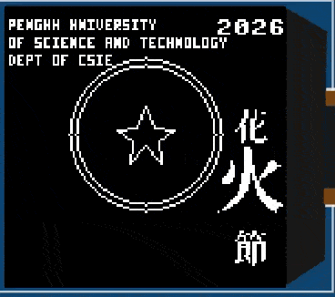
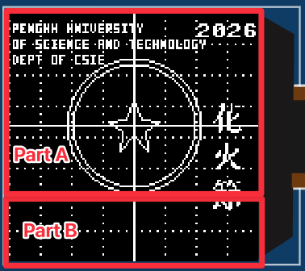

# Task 3A: Grove SH1107 OLED 128x128 座標校正與中文字 wrap

## 目標
本題使用 Wokwi 的 Grove SH1107 OLED，將 `task2` 的龍珠元素搬到 `128x128` 單色 OLED 上，並處理這塊板子在 Wokwi 中觀察到的 y 軸顯示映射問題。

目前畫面包含：
- 一星龍珠
- 英文資訊：`Penghu University`、`of Science and Technology`、`Dept of CSIE`
- 右上角 `2026`
- 右側直排 `花火節` 動畫：三個字依序放大 2 倍並做波浪舞



## OLED 規格
Wokwi 元件：

```json
{
  "type": "board-grove-oled-sh1107",
  "id": "oled1",
  "rotate": 270
}
```

重點規格：
- 顯示晶片：`SH1107`
- 顯示類型：Monochrome OLED
- 解析度：`128 x 128`
- 顏色：單色，`1` 亮、`0` 暗
- 通訊：I2C
- I2C 位址：`0x3C`
- Driver：`lib/sh1107.py`

這塊不是 SSD1306 `128x64`。如果用 `ssd1306.py` 或 `128x64` 假設，常見結果是上下切半、圖形 wrap、座標看起來不合理。

## 接線
`diagram.json` 目前接線：

```text
ESP32 3V3     -> OLED VCC
ESP32 GND.2   -> OLED GND.1
ESP32 GPIO22  -> OLED SDA
ESP32 GPIO21  -> OLED SCL.1
```

所以程式必須使用：

```python
i2c = I2C(0, scl=Pin(21), sda=Pin(22))
```

OLED 初始化：

```python
oled_width = 128
oled_height = 128
oled = sh1107.SH1107_I2C(oled_width, oled_height, i2c, address=0x3C, rotate=0)
```

## Grid 與校正中心
開發過程中曾使用 grid 觀察座標：

```python
center_x = 64
center_y = 90
grid_step = 16
```

grid 會畫滿 `128x128`，每 `16px` 一條虛線，並用實線標示：
- 垂直中心線：`x = 64`
- 水平校正中心線：`y = 90`

這裡的 `center_y = 90` 是 Wokwi 實測後的視覺中心，不是理論中心 `64`。也就是說，這塊 SH1107 在 Wokwi 中的可視映射與直覺的 `(64, 64)` 中心不同。

目前正式動畫畫面已移除 grid，但仍保留 `center_x = 64`、`center_y = 90` 作為龍珠中心。

一星龍珠直接畫在校正中心：

```python
draw_circle(oled, center_x, center_y, 35, 1)
draw_circle(oled, center_x, center_y, 32, 1)
draw_star(oled, center_x, center_y, 13, 1)
```



## 英文與年份位置
英文和 `2026` 使用文字 offset：

```python
text_y_offset = 36

def ty(y):
    return y + text_y_offset
```

目前放置：

```python
draw_tiny_text(oled, "Penghu University", 2, ty(2))
draw_tiny_text(oled, "of Science and Technology", 2, ty(10))
draw_tiny_text(oled, "Dept of CSIE", 2, ty(18))
oled.text("2026", 96, ty(2))
```

實際 y 位置：

```text
Penghu University: y = 38
of Science and Technology: y = 46
Dept of CSIE: y = 54
2026: y = 38
```

目前靜態背景集中在 `draw_static_scene(...)`：

```python
def draw_static_scene(display):
    display.fill(0)
    draw_circle(display, center_x, center_y, 35, 1)
    draw_circle(display, center_x, center_y, 32, 1)
    draw_star(display, center_x, center_y, 13, 1)
    draw_tiny_text(display, "Penghu University", 2, ty(2))
    draw_tiny_text(display, "of Science and Technology", 2, ty(10))
    draw_tiny_text(display, "Dept of CSIE", 2, ty(18))
    display.text("2026", 96, ty(2))
```

每一幀動畫都會先重畫靜態背景，再畫中文字動畫，避免上一幀殘影留在 OLED 上。

## 中文字繪製方式
中文字使用 32x32 點陣資料：

```python
CHARS = {
    '花': (FONT_82B1, 32, 32),
    '火': (FONT_706B, 32, 32),
    '節': (FONT_7BC0, 32, 32),
}
```

目前不使用 `blit()`，而是自行從 bytearray 解碼，再用最底層的 `display.pixel(...)` 畫點：

```python
def glyph_pixel(data, width, x, y):
    row_bytes = (width + 7) // 8
    value = data[y * row_bytes + x // 8]
    return (value >> (7 - (x % 8))) & 1
```

注意：bit order 要使用：

```python
7 - (x % 8)
```

如果寫成：

```python
x % 8
```

中文字會被反向讀取，畫面會出現破碎或亂碼感。

## `花火節` 的 y 軸 wrap 解法
靜態測試時，直排中文曾使用：

```python
draw_text_vertical(oled, "花火節", 104, 78, spacing=4, shrink=2, wrap_y=True)
```

`shrink=2` 時，每個字會由 `32x32` 縮成 `16x16`。因此座標如下：

```text
花: y = 78 ~ 93
火: y = 98 ~ 113
節: y = 118 ~ 133
```

OLED framebuffer 的一般範圍是：

```text
y = 0 ~ 127
```

若不處理，`節` 的 `128~133` 會被裁掉。但實測這塊 SH1107/Wokwi 顯示行為比較像 y 軸存在環狀映射，因此目前用 `wrap_y=True` 讓超出底部的 pixel 接回上方：

```python
if wrap_y:
    py %= oled_height
```

也就是：

```text
128 -> 0
129 -> 1
130 -> 2
131 -> 3
132 -> 4
133 -> 5
```

這樣 `節` 會完整顯示，符合目前 Wokwi 畫面觀察結果。

## `花火節` 波浪舞動畫
目前正式版不再使用靜態 `draw_text_vertical(...)`，而是使用動畫函式：

```python
def draw_dancing_chinese(display, frame):
    chars = "花火節"
    base_y = 78
    base_x = 104
    spacing = 4
    wave = (-5, 0, 5, 0)
    active = frame % len(chars)
    cy = base_y

    for i, ch in enumerate(chars):
        enlarged = i == active
        shrink = 1 if enlarged else 2
        size = 32 if enlarged else 16
        x = base_x - 8 if enlarged else base_x
        y = cy + wave[(frame + i) % len(wave)]

        if enlarged:
            y -= 8

        draw_char(display, ch, x, y, shrink=shrink, wrap_y=True)
        cy += size + spacing
```

動畫規則：
- `frame % 3` 決定目前哪一個字放大。
- 放大的字使用 `shrink=1`，也就是完整 `32x32`。
- 沒放大的字使用 `shrink=2`，也就是 `16x16`。
- `wave = (-5, 0, 5, 0)` 讓每個字產生上下波浪位移。
- 放大時 `x = base_x - 8`，讓 `32px` 寬的字向左補償，避免太靠右。
- 放大時 `y -= 8`，讓字以接近中心的方式放大，而不是只往下長。
- 所有中文字仍使用 `wrap_y=True`，確保跨過底部時接回上方。

主迴圈：

```python
frame = 0
while True:
    draw_static_scene(oled)
    draw_dancing_chinese(oled, frame)
    oled.show()
    frame = (frame + 1) % 3
    time.sleep_ms(250)
```

每 `250ms` 更新一次畫面。

## RCA：為什麼 grid 可以畫，但 `節` 看起來畫不上
一開始看起來像是：

```text
grid 可以畫到底部，但節不能畫到同一區域
```

實際原因不是 grid 和 pixel 的能力不同，而是座標與字高不同：
- grid 的點大多落在 `0~127` 內，例如 `y=120`、`y=124` 都合法。
- `節` 若放在 `y=118` 且高度是 `16`，會延伸到 `133`。
- `128~133` 超出一般 framebuffer 範圍，若沒有 wrap 就會消失。

因此問題不是 `display.pixel()` 不能畫字，而是中文字的一部分跨過了 `127` 邊界。

## RCA：為什麼畫面曾經變成亂碼
曾經將中文字繪製改成 raw byte 解碼時，使用了錯誤 bit order：

```python
return (value >> (x % 8)) & 1
```

這會造成中文字點陣左右 bit 順序錯誤，導致畫面看起來像亂碼。

修正後：

```python
return (value >> (7 - (x % 8))) & 1
```

另外，RCA 過程曾經直接把多個測試用 `節` 字畫在畫面上，這會污染主畫面。現在已移除那些測試字，只保留正式的 `花火節`。

## 關鍵函式
目前中文繪製路徑：

```python
def draw_char_pixels(display, char, x, y, shrink=1, wrap_y=False):
    ...
    if wrap_y:
        py %= oled_height
    if glyph_pixel(data, w, sx, sy):
        if 0 <= px < oled_width and 0 <= py < oled_height:
            display.pixel(px, py, 1)
```

直排文字：

```python
def draw_text_vertical(display, text, x, y, spacing=0, shrink=1, wrap_y=False):
    cy = y
    for ch in text:
        if ch in CHARS:
            _, _, h = CHARS[ch]
            draw_char(display, ch, x, cy, shrink=shrink, wrap_y=wrap_y)
            cy += (h + shrink - 1) // shrink + spacing
```

## 執行方式
在 `task3a` 目錄執行：

```bash
make run
```

若出現：

```text
ModuleNotFoundError: No module named 'serial'
```

安裝：

```bash
python3 -m pip install pyserial
```

## 目前結論
目前最穩定的作法是：
- SH1107 使用 `128x128`
- grid 只作為開發定位參考，正式動畫畫面已移除
- 龍珠中心用 `(64, 90)`
- 中文點陣用 raw byte 解碼後逐 pixel 繪製
- 中文跨越底部時使用 `wrap_y=True`
- `花火節` 動畫以 `shrink=1`/`shrink=2` 切換大小，達成放大 2 倍效果

這個 `wrap_y=True` 是針對目前 Wokwi SH1107 元件觀察到的顯示映射所做的程式層補償，不代表所有實體 SH1107 模組都需要相同處理。
