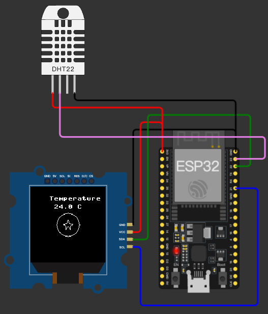

# Task 4: ESP32 + DHT22 溫度顯示（SH1107 OLED）

## 目標
本題使用 ESP32 讀取 DHT22 溫度，並在 Grove SH1107 OLED 上顯示：
- 溫度資料（`Temperature` + `xx.x C`）
- 一星龍珠圖案（圓 + 星）
- 同時在 Serial Console 輸出 debug 訊息

目前版本已移除 grid，畫面只保留溫度資訊與一星龍珠。



## 硬體元件
- `board-esp32-devkit-c-v4`
- `board-grove-oled-sh1107`（128x128, I2C）
- `wokwi-dht22`

## 接線（依 `diagram.json`）

### OLED (SH1107)
- `ESP32 GPIO22 -> OLED SDA`
- `ESP32 GPIO21 -> OLED SCL`
- `ESP32 3V3 -> OLED VCC`
- `ESP32 GND -> OLED GND`

### DHT22
- `ESP32 GPIO23 -> DHT22 SDA`
- `ESP32 3V3 -> DHT22 VCC`
- `ESP32 GND -> DHT22 GND`

## 目前程式重點

### 1) OLED 初始化
```python
oled = sh1107.SH1107_I2C(128, 128, i2c, address=0x3C, rotate=90)
```

### 2) DHT22 讀值
```python
dht_sensor = dht.DHT22(Pin(23))
dht_sensor.measure()
temp_c = dht_sensor.temperature()
humidity = dht_sensor.humidity()
```

### 3) Console Debug
每次更新都會輸出：
```text
[DEBUG] temperature = 24.0C, humidity = 53.0%
```

若讀值失敗會輸出：
```text
[ERROR] DHT22 read failed: <error>
```

### 4) OLED 顯示內容
- 文字顯示在一星龍珠正上方，並依龍珠中心自動對齊
- 一星龍珠中心使用校正座標（非單純 `64,64`）：

```python
center_x = 64
center_y = 64
dragon_center_x = center_x - 32
dragon_center_y = center_y
```

這組偏移是依目前 Wokwi 實測畫面調整，用來貼近面板可視中心。

### 5) 無 Grid
目前已移除 `draw_grid(...)` 呼叫，不再顯示定位網格。

## 主要顯示流程（摘要）
```python
oled.fill(0)

# 文字（依龍珠中心對齊）
title = "Temperature"
temp_text = "{:.1f} C".format(temp_c)
title_x = max(0, dragon_center_x - (len(title) * 8) // 2)
temp_x = max(0, dragon_center_x - (len(temp_text) * 8) // 2)
oled.text(title, title_x, 16)
oled.text(temp_text, temp_x, 30)

# 一星龍珠
draw_circle(oled, dragon_center_x, dragon_center_y, 20, 1)
draw_star(oled, dragon_center_x, dragon_center_y, 8, 1)

oled.show()
```

## 注意事項
- `dht` 在多數 ESP32 MicroPython 韌體中是內建模組；若環境缺少，會出現 `ImportError`。
- SH1107 在 Wokwi 的可視區與座標映射可能與直覺中心有落差，因此保留 `dragon_center_x / y` 做校正。
- 文字採用 `max(0, x)` 保護，避免左邊字元被裁切（例如 `Temperature` 的 `T` 消失）。

## 執行
在 `task4` 目錄執行：

```bash
make run
```

若環境缺少 `pyserial`：

```bash
python3 -m pip install pyserial
```
